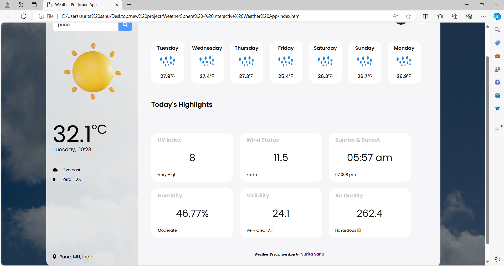
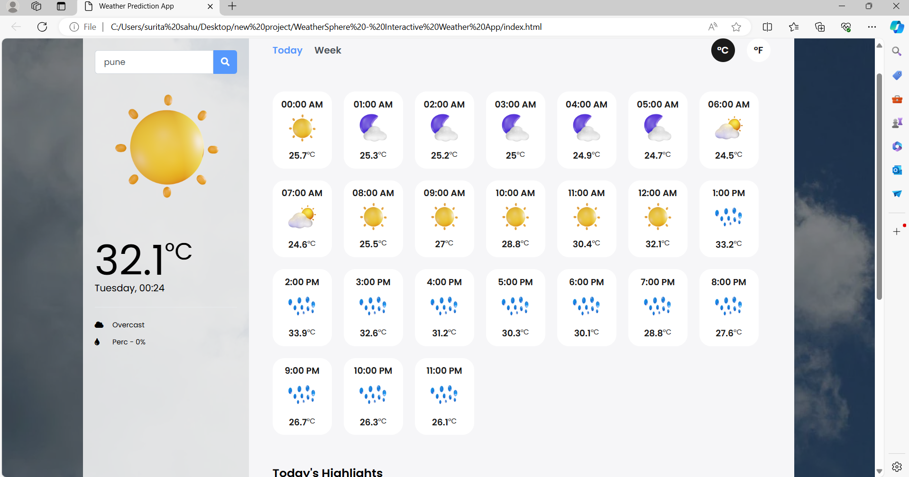
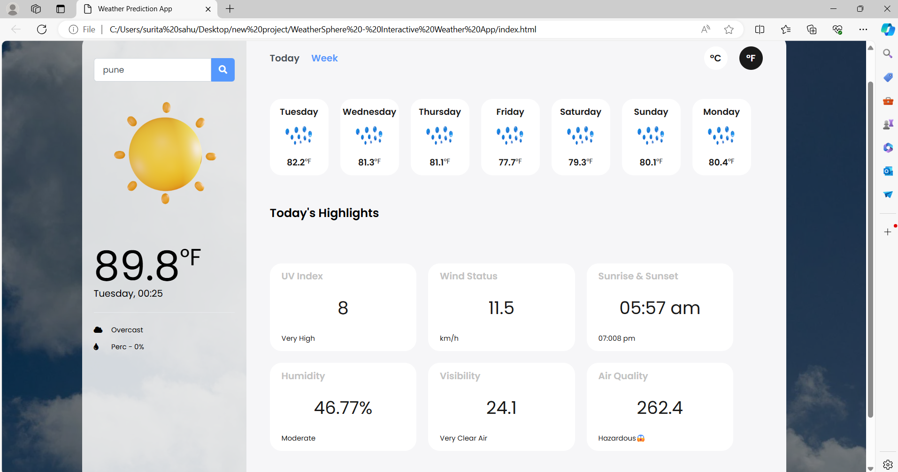

# WeatherSphere - Interactive Weather App

## Overview

Welcome to WeatherSphere, a cutting-edge and user-friendly weather prediction app. WeatherSphere not only provides accurate weather forecasts but also offers an engaging and intuitive user experience.

### Features:

- **Responsive Design:** Enjoy a seamless experience across various devices with WeatherSphere's responsive UI.
- **Dynamic Weather Icons:** Visualize real-time weather conditions with dynamic icons for a more immersive experience.
- **Hourly and Weekly Forecasts:** Plan your schedule confidently with detailed hourly and weekly forecasts.
- **Today's Highlights:** Stay informed about key weather highlights, including UV Index, Wind Status, Sunrise & Sunset, Humidity, Visibility, and Air Quality.
- **Search Functionality:** Easily search for weather updates in any location globally.

## Experience WeatherSphere

🌦️ **Explore the WeatherSphere Demo: [Click Here](---)** 🌈

## Screenshots

## Getting Started

1. Clone the repository: `git clone -`
2. Open `index.html` in your preferred browser to launch the app.

## Usage

- Enter a location in the search bar to get the current weather details for that area.
- Switch between hourly and weekly forecasts for detailed weather information.
- Explore the highlight cards to learn more about today's weather insights.

## License

WeatherSphere is licensed under the [MIT License](LICENSE.md). 
Feel free to customize and use it in your projects.

## Author

[Surita Sahu](https://github.com/suritasahu)

## Contribution

Contributions are welcome! Please check our [Contribution Guidelines](CONTRIBUTING.md).

## Support

If you encounter any issues or have suggestions, [open an issue](https://github.com/suritasahu/Weather-Sphere---Interactive-Weather-App/issues).

## About

WeatherSphere is the result of a passion for creating user-friendly applications that empower individuals to make informed decisions. Inspired by a love for technology and the desire to simplify weather information, Surita Sahu set out to develop a weather app that seamlessly integrates accuracy with an engaging user experience. Join us in exploring the world of WeatherSphere!
